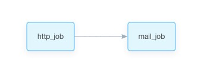
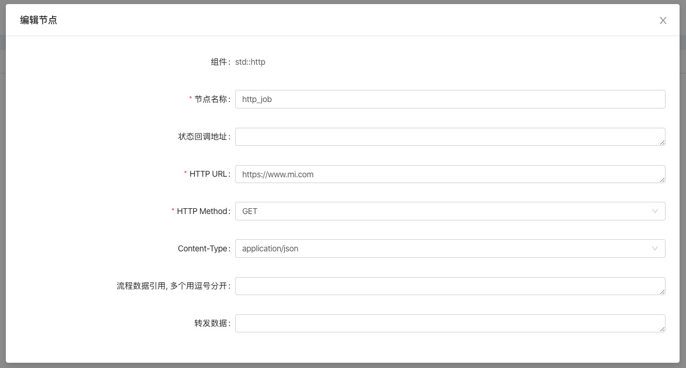
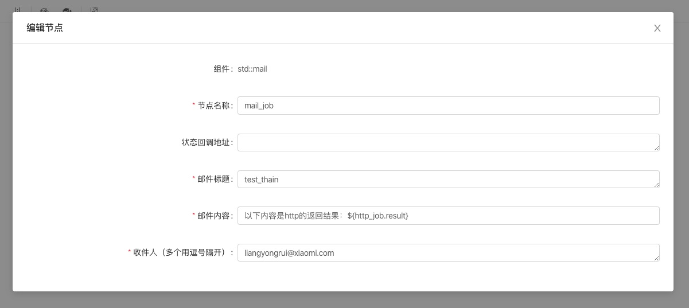
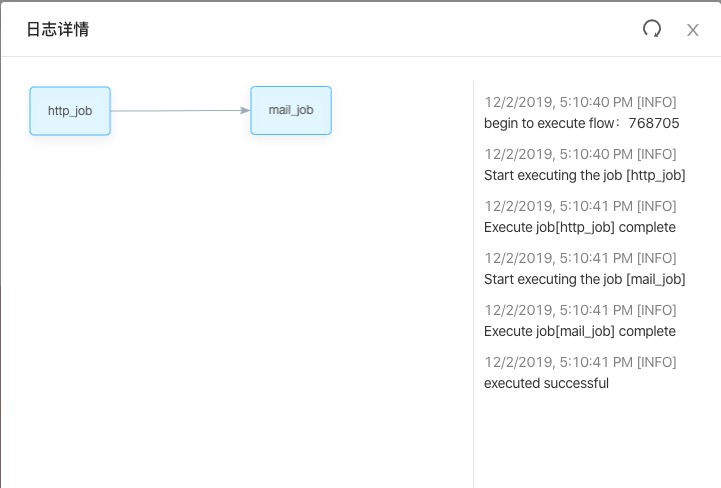
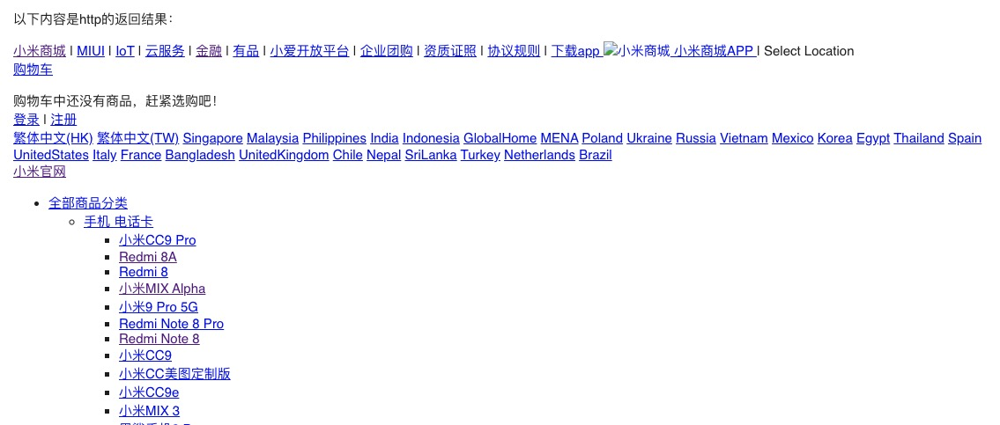

<!--
 Copyright (c) 2019, Xiaomi, Inc.  All rights reserved.
 This source code is licensed under the Apache License Version 2.0, which
 can be found in the LICENSE file in the root directory of this source tree.
-->

# 组件组合使用示例

1. 新建一个 flow

1. 里面有两个节点，http 和 mail

   

1. http_job 的参数

   

1. mail_job 的参数

   

1. 创建完成后，点击立即执行

1. 执行后的日志

   

1. 邮件产生的结果

   

   因为 http 得到的是一串不完整的 html，所以渲染出来“有点丑”
