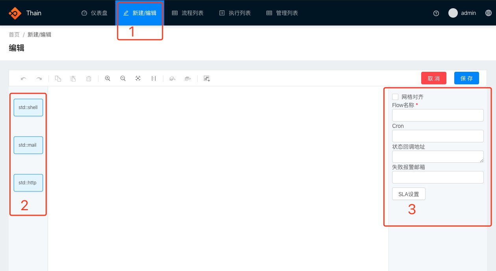
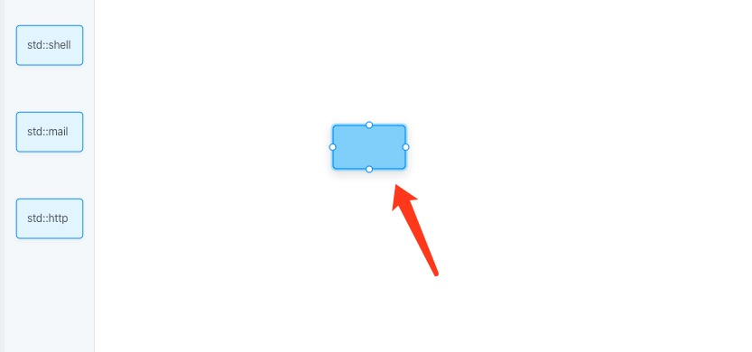
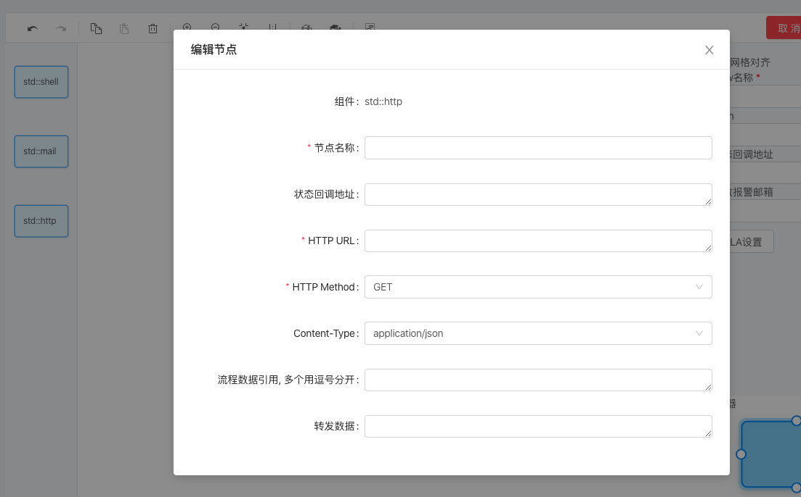

<!--
 Copyright (c) 2019, Xiaomi, Inc.  All rights reserved.
 This source code is licensed under the Apache License Version 2.0, which
 can be found in the LICENSE file in the root directory of this source tree.
-->

# 创建 Flow

## 整体介绍

如图，点击 区域1 进入新建Flow页面

区域2 为 已有的组件，可以通过拖动组件来创建一个job

区域3 为 flow属性设置区域，可以通过相应的只来设置flow

## Job介绍

如图，拖动一个组件后，你会获得一个job，点击这个job，你可以对他进行编辑。

> 每个组件具体的说明见文档 [组件](../component/std/http.md)

